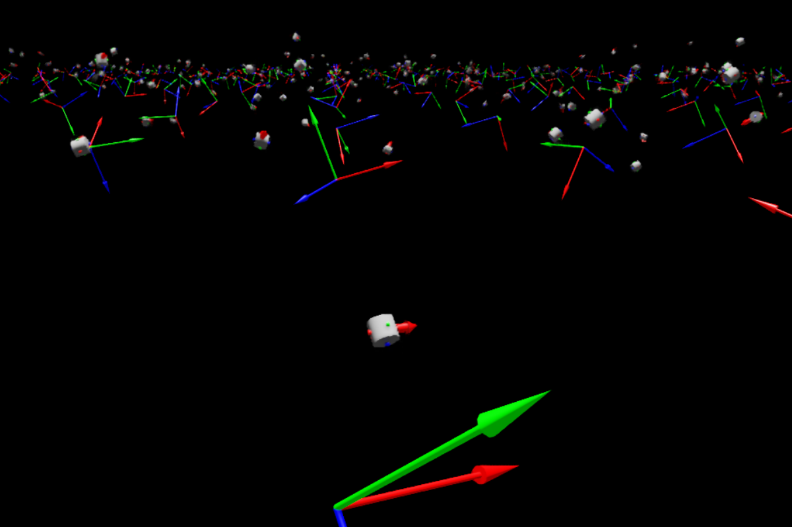

 

## About this Repository

This repository serves as an extension to the [OmniIsaacGymEnvs](https://github.com/NVIDIA-Omniverse/OmniIsaacGymEnvs) framework, enhancing its capabilities with additional robots and advanced features. The primary goal is to provide a more flexible environment for deploying various **code-generated robotic** and performing complex **navigation tasks**. 
### Key Features

- **Extended Robot Library**: Introduces new robots to the existing OmniIsaacGymEnvs framework, enabling a wider range of simulations and applications.
- **Navigation Tasks**: Includes a variety of navigation tasks designed to test and benchmark robotic performance in different scenarios.
- **Modular Extensions**: Supports features like domain randomization to improve robustness and automated curriculum learning to optimize training processes.

<head>
  <style>
    .responsive-img {
      max-height: 100px; /* Adjust this value to your desired height */
      max-width: 250px;
    }
  </style>
</head>

### Robots Included

| 2D Satellite | 3D Satellite | Heron USV | Turtle-bots | Husky car |
| :-: | :-: | :-: | :-: | :-: |
|  |  |  |  |  |

- **2D Satellite**: Simulates basic satellite maneuvers in a 2D plane.
- **3D Satellite**: Extends satellite control to 3D space for more complex operations.
- **Heron USV**: A surface vessel used for aquatic navigation tasks.
- **Turtle-bots**: Compact mobile robots suitable for indoor navigation.
- **Husky car**: A rugged, all-terrain robot for outdoor navigation.

## Navigation Tasks Available

This library provides a set of predefined navigation tasks for robotic control and reinforcement learning. It allows for easy extensions to add new tasks or modify existing ones to suit different requirements.

### Tasks list
- GoToPosition
- GoToPose
- Track Linear Velocity
- Track Linear & Angular Velocity
- Track Linear Velocity & Heading
- GoThroughPosition / Sequence
- GoThroughPose / Sequence
- GoThroughGate / Sequence

<details> 
  <summary><h3 style="display: inline;">Click to Open Task Descriptions</h3></summary>


  | Task                        | Objective and Challenge                                                                                                                                  | Image                           |
  |-----------------------------|----------------------------------------------------------------------------------------------------------------------------------------------------------|---------------------------------|
  | **GoToPosition**            | Navigate to a specific target position. Accurately reach position within a given distance.                                                |  |
  | **GoToPose**                | Reach a specific target position and orientation. Manage both position and heading errors, within a given distance.                       |  |
  | **Track Linear Velocity**   | Achieve and maintain a specific linear velocity. Precisely track the target velocity.                                                                     |  |
  | **Track Linear & Angular Velocity** | Achieve and maintain specific linear and angular velocities. Manage both linear and angular velocity tracking.                                             |  |
  | **Track Linear Velocity & Heading** | Achieve and maintain a specific linear velocity while following a heading. Track linear velocity and heading simultaneously.                           |  |
  | **GoThroughPosition / Sequence** | Pass through a specific position or sequence while continuing the trajectory. Ensure precise traversal within a given distance (0.1cm default).                   |  |
  | **GoThroughPose / Sequence** | Pass through a target position and orientation or sequence. Achieve accuracy in both position and heading within a given distance (0.1cm default).                  |  |
  | **GoThroughGate / Sequence** | Pass through a gate or a series of gates in a specific direction without touching them. Maintain accuracy with a tolerance of 1m (default) and avoid crossing in the wrong direction. |  |

</details>

---
## Installation

Follow the Isaac Sim [documentation](https://docs.omniverse.nvidia.com/isaacsim/latest/installation/install_workstation.html) to install the latest Isaac Sim release. 

*Examples in this repository rely on features from the most recent Isaac Sim release. Please make sure to update any existing Isaac Sim build to the latest release version, 2022.2.0, to ensure examples work as expected.*

### OmniverseIsaacGymEnvs
Once installed, this repository can be used as a python module, `omniisaacgymenvs`, with the python executable provided in Isaac Sim.

To install `omniisaacgymenvs`, first clone this repository:

```bash
git clone https://github.com/elharirymatteo/RANS.git
```

Once cloned, locate the [python executable in Isaac Sim](https://docs.omniverse.nvidia.com/isaacsim/latest/installation/install_python.html). By default, this should be `python.sh`. We will refer to this path as `PYTHON_PATH`.

To set a `PYTHON_PATH` variable in the terminal that links to the python executable, we can run a command that resembles the following. Make sure to update the paths to your local path.

```
For Linux: alias PYTHON_PATH=~/.local/share/ov/pkg/isaac_sim-*/python.sh
For Windows: doskey PYTHON_PATH=C:\Users\user\AppData\Local\ov\pkg\isaac_sim-*\python.bat $*
For IsaacSim Docker: alias PYTHON_PATH=/isaac-sim/python.sh
```

Install `omniisaacgymenvs` as a python module for `PYTHON_PATH`:

```bash
PYTHON_PATH -m pip install -e .
```

### RL Games

We use the [rl-games](https://pypi.org/project/rl-games/1.0.2/) library as a starting point to rework the PPO implementation for the agents we train.

To install the appropriate version of rl-games, clone this repository **INSIDE** RANS:
```bash
git clone https://github.com/AntoineRichard/rl_games
```
Make sure to install the rl_gamers library under the OmniverseIsaacGym dependecy:
```
cd rl_games
PYTHON_PATH -m pip install --upgrade pip
PYTHON_PATH -m pip install -e .
```

## Running the examples

*Note: All commands should be executed from `OmniIsaacGymEnvs/omniisaacgymenvs`.*

<details>
<summary><span style="font-size: 1.3em; font-weight: bold;">Training new agents</span></summary>


To train your first policy, (example for the USV robot) run:

```bash
PYTHON_PATH scripts/rlgames_train_RANS.py task=ASV/GoToPose train=RANS/PPOcontinuous_MLP headless=True num_envs=1024
```
Modify num_envs appropriately to scale with your current machine capabilities. Turn headless to `False` if you want to visualize the envs while training occurs.

You should see an Isaac Sim window pop up. Once Isaac Sim initialization completes, the scene for the selected robot will be constructed and simulation will start running automatically. The process will terminate once training finishes.


Here's another example - GoToPose for the Satellite robot (MFP - modular floating platform) - using the multi-threaded training script:

```bash
PYTHON_PATH scripts/rlgames_train_RANS.py task=MFP2D/GoToPose train=RANS/PPOmulti_discrete_MLP
```

Note that by default, we show a Viewport window with rendering, which slows down training. You can choose to close the Viewport window during training for better performance. The Viewport window can be re-enabled by selecting `Window > Viewport` from the top menu bar.

To achieve maximum performance, launch training in `headless` mode as follows:

```bash
PYTHON_PATH scripts/rlgames_train_RANS.py task=MFP2D/GoToPose train=PPOmulti_discrete_MLP headless=True
```

#### A Note on the Startup Time of the Simulation

Some of the examples could take a few minutes to load because the startup time scales based on the number of environments. The startup time will continually
be optimized in future releases.

</details>

<details>
<summary><span style="font-size: 1.3em; font-weight: bold;">Loading trained models (or checkpoints)</span></summary>

Checkpoints are saved in the folder `runs/EXPERIMENT_NAME/nn` where `EXPERIMENT_NAME` 
defaults to the task name, but can also be overridden via the `experiment` argument.

To load a trained checkpoint and continue training, use the `checkpoint` argument:

```bash
PYTHON_PATH scripts/rlgames_train_RANS.py task=MFP2D/GoToPose train=RANS/PPOmulti_discrete_MLP checkpoint=runs/MFP2D_GoToPose/nn/MFP2D_GoToPose.pth
```

To load a trained checkpoint and only perform inference (no training), pass `test=True` 
as an argument, along with the checkpoint name. To avoid rendering overhead, you may 
also want to run with fewer environments using `num_envs=64`:

```bash
PYTHON_PATH scripts/rlgames_train_RANS.py task=MFP2D/GoToPose train=RANS/PPOmulti_discrete_MLP checkpoint=runs/MFP2D_GoToPose/nn/MFP2D_GoToPose.pth test=True num_envs=64
```

Note that if there are special characters such as `[` or `=` in the checkpoint names, 
you will need to escape them and put quotes around the string. For example,
`checkpoint="runs/Ant/nn/last_Antep\=501rew\[5981.31\].pth"`
</details>

## Training Scripts

All scripts provided in `omniisaacgymenvs/scripts` can be launched directly with `PYTHON_PATH`.

<details>
<summary><span style="font-size: 1.3em; font-weight: bold;">Random policy</span></summary>
To test out a task without RL in the loop, run the random policy script with:

```bash
PYTHON_PATH scripts/random_policy.py task=virtual_floating_platform/MFP2D_Virtual_GoToXY
```

This script will sample random actions from the action space and apply these actions to your task without running any RL policies. Simulation should start automatically after launching the script, and will run indefinitely until terminated.
</details>

<details>
<summary><span style="font-size: 1.3em; font-weight: bold;">Train on single GPU</span></summary>
To run a simple form of PPO from `rl_games`, use the single-threaded training script:

```bash
PYTHON_PATH scripts/rlgames_train_mfp.py task=virtual_floating_platform/MFP2D_Virtual_GoToXY
```

This script creates an instance of the PPO runner in `rl_games` and automatically launches training and simulation. Once training completes (the total number of iterations have been reached), the script will exit. If running inference with `test=True checkpoint=<path/to/checkpoint>`, the script will run indefinitely until terminated. Note that this script will have limitations on interaction with the UI.
</details>

<details>
<summary><span style="font-size: 1.3em; font-weight: bold;">Train on multiple GPUs</span></summary>
Lastly, we provide a multi-threaded training script that executes the RL policy on a separate thread than the main thread used for simulation and rendering:

```bash
PYTHON_PATH scripts/rlgames_train_mfp.py task=virtual_floating_platform/MFP2D_Virtual_GoToXY
```

This script uses the same RL Games PPO policy as the above, but runs the RL loop on a new thread. Communication between the RL thread and the main thread happens on threaded Queues. Simulation will start automatically, but the script will **not** exit when training terminates, except when running in headless mode. Simulation will stop when training completes or can be stopped by clicking on the Stop button in the UI. Training can be launched again by clicking on the Play button. Similarly, if running inference with `test=True checkpoint=<path/to/checkpoint>`, simulation will run until the Stop button is clicked, or the script will run indefinitely until the process is terminated.
</details>

<details>
<summary><span style="font-size: 1.3em; font-weight: bold;">Configuration and command line arguments</span></summary>

We use [Hydra](https://hydra.cc/docs/intro/) to manage the config.
 
Common arguments for the training scripts are:

* `task=TASK` - Selects which task to use. Any of `MFP2D_Virtual_GoToXY`, `MFP2D_Virtual_GoToPose`, `MFP2D_Virtual_TrackXYVelocity`, `MFP2D_Virtual_TrackXYOVelocity`, `MFP3D_Virtual_GoToXYZ`, `MFP3D_Virtual_GoToPose`, (these correspond to the config for each environment in the folder `omniisaacgymenvs/cfg/task/virtual_floating_platform`)
* `train=TRAIN` - Selects which training config to use. Will automatically default to the correct config for the environment (ie. `<TASK>PPO`).
* `num_envs=NUM_ENVS` - Selects the number of environments to use (overriding the default number of environments set in the task config).
* `seed=SEED` - Sets a seed value for randomization, and overrides the default seed in the task config
* `pipeline=PIPELINE` - Which API pipeline to use. Defaults to `gpu`, can also set to `cpu`. When using the `gpu` pipeline, all data stays on the GPU. When using the `cpu` pipeline, simulation can run on either CPU or GPU, depending on the `sim_device` setting, but a copy of the data is always made on the CPU at every step.
* `sim_device=SIM_DEVICE` - Device used for physics simulation. Set to `gpu` (default) to use GPU and to `cpu` for CPU.
* `device_id=DEVICE_ID` - Device ID for GPU to use for simulation and task. Defaults to `0`. This parameter will only be used if simulation runs on GPU.
* `rl_device=RL_DEVICE` - Which device / ID to use for the RL algorithm. Defaults to `cuda:0`, and follows PyTorch-like device syntax.
* `test=TEST`- If set to `True`, only runs inference on the policy and does not do any training.
* `checkpoint=CHECKPOINT_PATH` - Path to the checkpoint to load for training or testing.
* `headless=HEADLESS` - Whether to run in headless mode.
* `experiment=EXPERIMENT` - Sets the name of the experiment.
* `max_iterations=MAX_ITERATIONS` - Sets how many iterations to run for. Reasonable defaults are provided for the provided environments.
* `warp=WARP` - If set to True, launch the task implemented with Warp backend (Note: not all tasks have a Warp implementation).
* `kit_app=KIT_APP` - Specifies the absolute path to the kit app file to be used.

Hydra also allows setting variables inside config files directly as command line arguments. As an example, to set the minibatch size for a rl_games training run, you can use `train.params.config.minibatch_size=64`. Similarly, variables in task configs can also be set. For example, `task.env.episodeLength=100`.

#### Hydra Notes

Default values for each of these are found in the `omniisaacgymenvs/cfg/config.yaml` file.

The way that the `task` and `train` portions of the config works are through the use of config groups. 
You can learn more about how these work [here](https://hydra.cc/docs/tutorials/structured_config/config_groups/)
The actual configs for `task` are in `omniisaacgymenvs/cfg/task/<TASK>.yaml` and for `train` in `omniisaacgymenvs/cfg/train/<TASK>PPO.yaml`. 

In some places in the config you will find other variables referenced (for example,
 `num_actors: ${....task.env.numEnvs}`). Each `.` represents going one level up in the config hierarchy.
 This is documented fully [here](https://omegaconf.readthedocs.io/en/latest/usage.html#variable-interpolation).

</details>

### Tensorboard

Tensorboard can be launched during training via the following command:
```bash
PYTHON_PATH -m tensorboard.main --logdir runs/EXPERIMENT_NAME/summaries
```

## WandB support

You can run (WandB)[https://wandb.ai/] with OmniIsaacGymEnvs by setting `wandb_activate=True` flag from the command line. You can set the group, name, entity, and project for the run by setting the `wandb_group`, `wandb_name`, `wandb_entity` and `wandb_project` arguments. Make sure you have WandB installed in the Isaac Sim Python executable with `PYTHON_PATH -m pip install wandb` before activating.

## Citation 
If you use the current repository in your work, we suggest citing the following papers:

```bibtex
@article{el2023drift,
  title={DRIFT: Deep Reinforcement Learning for Intelligent Floating Platforms Trajectories},
  author={El-Hariry, Matteo and Richard, Antoine and Muralidharan, Vivek and Yalcin, Baris Can and Geist, Matthieu and Olivares-Mendez, Miguel},
  journal={arXiv preprint arXiv:2310.04266},
  year={2023}
}

@article{el2023rans,
  title={RANS: Highly-Parallelised Simulator for Reinforcement Learning based Autonomous Navigating Spacecrafts},
  author={El-Hariry, Matteo and Richard, Antoine and Olivares-Mendez, Miguel},
  journal={arXiv preprint arXiv:2310.07393},
  year={2023}
}
```

## Directory Structure (most relevant folders shown)

```bash
.
├── cfg                                 # Configuration files
│   ├── controller                      # Controller configurations
│   └──  hl_task                         # High-level task configurations convergence task
│   └── train                           # Training configurations
│       └── MFP                         # Training configurations for Modular Floating Platform
├── demos                               # Demonstration files (e.g., gifs, videos)
├── doc                                 # Documentation files
│   ├── curriculum.md                   # Documentation for curriculum
│   ├── domain_randomization.md         # Documentation for domain randomization
│   ├── figures                         # Figures used in documentation
│   │   └── ...                         # Other figure files
│   └── penalties.md                    # Documentation for penalties
├── envs                                # Environment scripts
│   ├── vec_env_rlgames_mfp.py          # Vectorized environment for rlgames with MFP
│   ├── vec_env_rlgames_mt.py           # Vectorized environment for rlgames with multiple tasks
│   └── vec_env_rlgames.py              # General vectorized environment for rlgames
├── extension.py                        # Extension script
├── images                              # Image files
│   ├── 3dof_gotoxy.png                 # Image for 3DOF GoToXY task
│   └── ...                             # Other image files
├── __init__.py                         # Initialization script for the package
├── lab_tests                           # Lab test scripts and data
├── mj_runs                             # Mujoco run scripts and data
├── models                              # Model files
├── robots                              # Robot related files
│   ├── articulations                   # Articulation files for robots
│   ├── sensors                         # Sensor files for robots
│   └── usd                             # USD files for robots
├── ros                                 # ROS related files
├── scripts                             # Utility scripts
├── tasks                               # Task implementations
│   └── MFP                             # Task implementations for Modular Floating Platform
│       ├── curriculum_helpers.py       # Helper functions for curriculum
│       └── unit_tests                  # Unit tests for MFP tasks
├── utils                               # Utility functions and scripts
│   ├── aggregate_and_eval_mujoco_batch_data.py  # Script to aggregate and evaluate Mujoco batch data
│   ├── rlgames                         # RL games related utilities
│   │   ├── __pycache__                 # Compiled Python files
│   │   ├── rlgames_train_mt.py         # Training script for RL games with multiple tasks
│   │   └── rlgames_utils.py            # Utility functions for RL games
├── videos                              # Video files
└── wandb                               # Weights and Biases integration files

```
