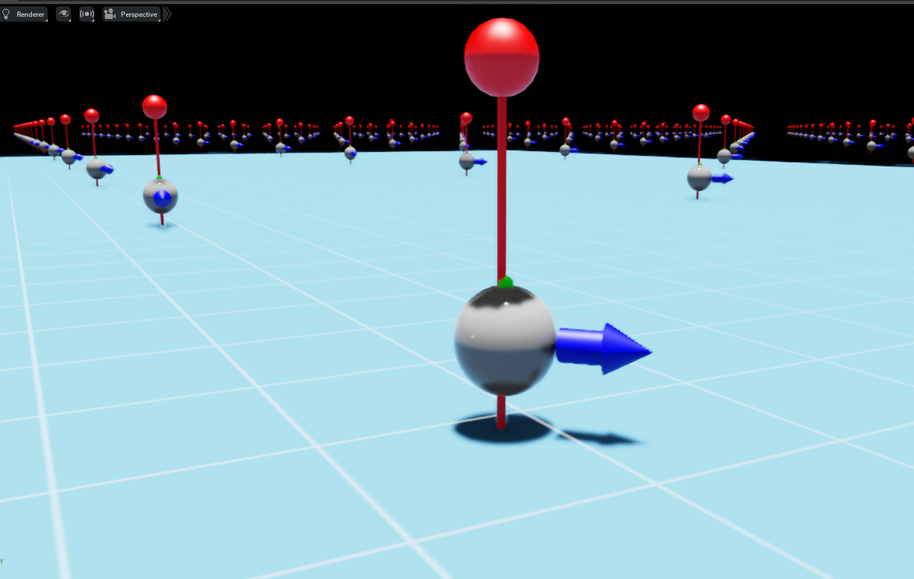
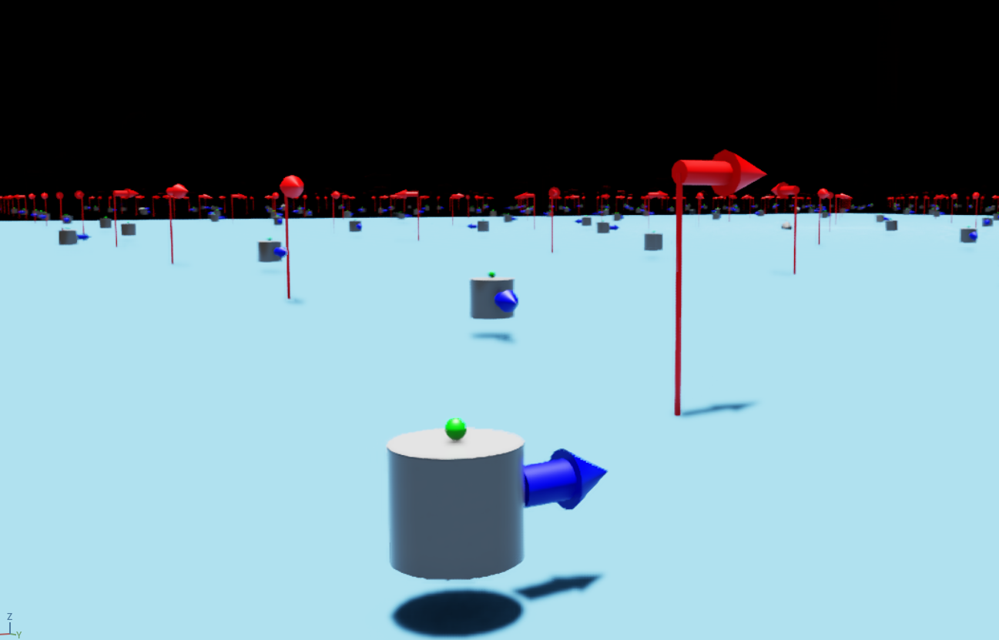
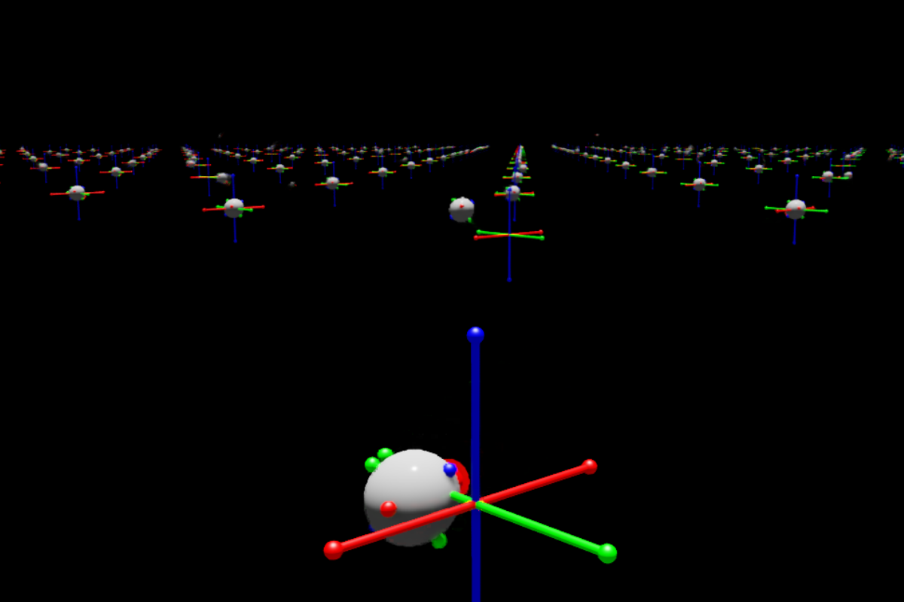
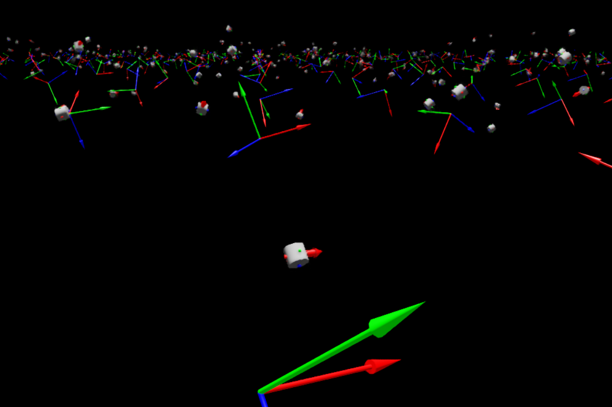

# ASTRA - Release Notes

⚠️ 
For the most up-to-date information and code, please refer to the <a href="https://github.com/elharirymatteo/RANS/tree/main"> main repository </a>
.

## Overview

This release corresponds to the version of the code used in the research paper titled "RANS: Highly-Parallelised Simulator for Reinforcement learning based Autonomous Navigating Spacecrafts." The repository contains the implementation and simulation environment (RANS) discussed in the paper. It serves as a valuable resource for reproducing the experiments and understanding the methodologies employed in the research.

## Introduction

RANS (Reinforcement learning-based Autonomous Navigation for Spacecrafts) is designed to address the specific needs of RL-based spacecraft navigation. The primary aim of RANS is to bridge the gap between available simulation tools and the specialized requirements of spacecraft navigation using reinforcement learning. RANS offers a new alternative to design autonomous trajectories in 2D and 3D space.

**Renders examples** of both 3DoF and 6DoF environments when the UI is enabled. The Floating platform or satellites are represented as either a sphere or a  cylinder, while the pin, and arrows indicate the goal the agent must reach.
 | 3DoF Go To XY | 3DoF Go To Pose |
 | :-: | :-: | 
 | 

 | 6DoF Go To XYZ | 6DoF Go To Pose |
 | :-: | :-: |  
 | 

Architecture and Objectives

RANS is structured to replicate realistic orbital operations as well as air-bearing platforms, providing a fast, stable, and precise simulation environment. It consists of two main scenarios: a 3 Degree of Freedom (DoF) "Floating Platform" (FP) robot and a 6 DoF navigating scenario. These scenarios allow users to specify or randomize initial conditions and goals for spacecraft control tasks.

Simulation Engine

RANS utilizes the PhysX engine within IsaacSim, a GPU-based physics engine renowned for its capacity to rapidly simulate numerous parallel systems. A sub-stepping strategy is employed to maintain simulation stability, especially conducive for reinforcement learning tasks characterized by short time intervals.

Environment and Tasks

In both 3 DoF and 6 DoF scenarios, RANS provides a default system configuration with varying thruster setups to accommodate different control tasks. The observation and action spaces are appropriately defined for each scenario and task, allowing for precise control and movement in the specified environment.

DRL Agents

The evaluation of RANS involves leveraging PPO (Proximal Policy Optimization) policies with multi-discrete action-space to solve various tasks in both 3 DoF and 6 DoF scenarios. The agents are modeled as actor-critic networks and are trained for specific epochs with varying network architectures to suit the task complexity.

