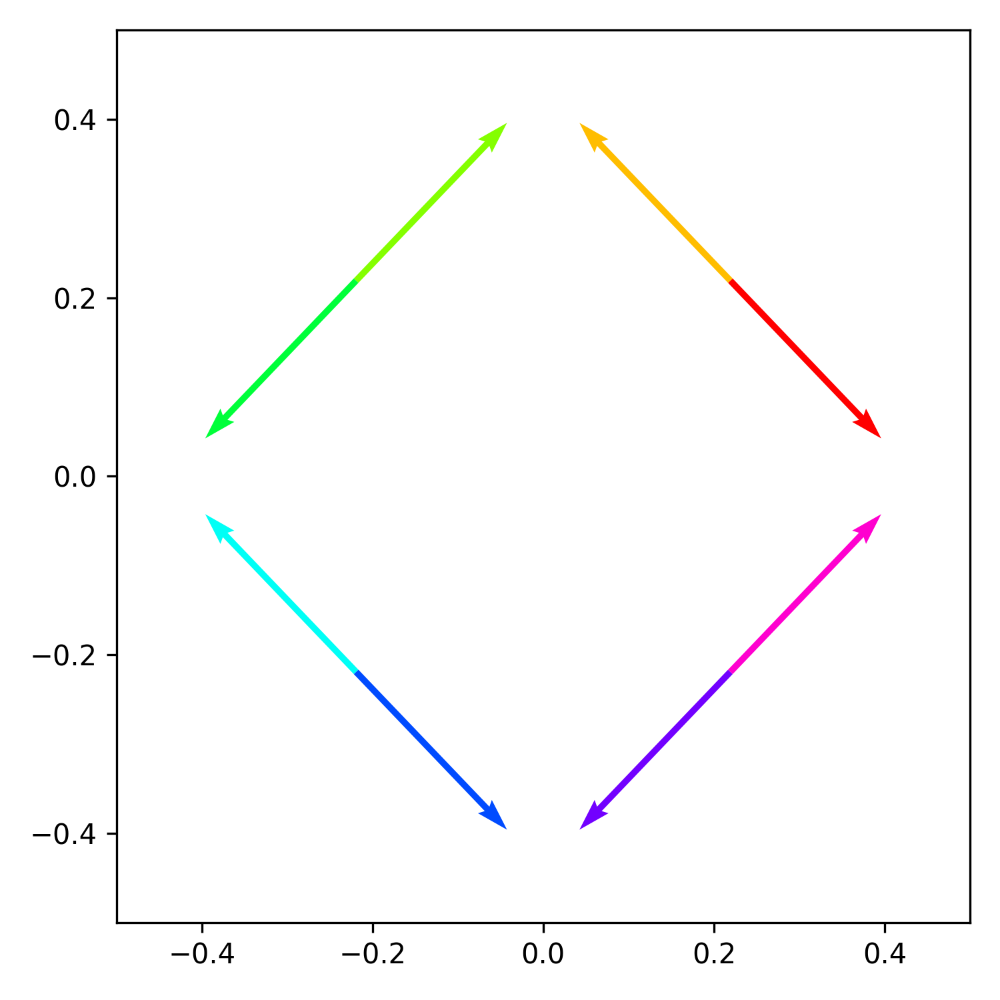
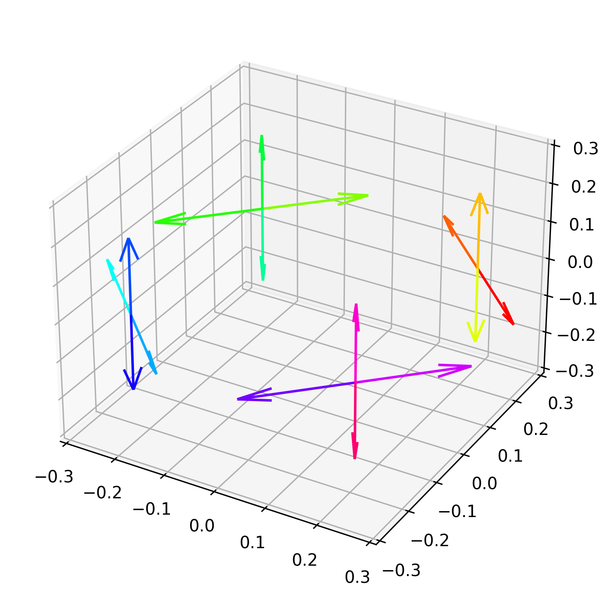
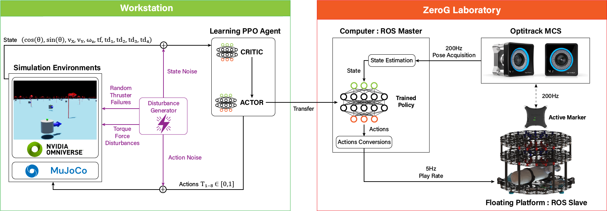

# DRIFT - Release Notes

## Overview

This release corresponds to the version of the code used in the research paper titled "DRIFT: Deep Reinforcement Learning for Intelligent Floating Platforms Trajectories". The problem formulation, simulation details, training procedure, and benchmarks discussed in the paper are based on this version.

<details>
<summary><span style="font-size: 1.2em; font-weight: bold;">Problem Formulation</span></summary>

The problem is formulated as a sequential decision-making task to control a floating platform's maneuvers within a 2D space. The state space, actions, and task-specific observations are defined as per the equations and tables provided in the paper.

| 3DoF Thrusters Configuration | 6DoF Thrusters Configuration |
| :-: | :-: |
|  |  |
</details>

<details>
<summary><span style="font-size: 1.2em; font-weight: bold;">Reward Functions</span></summary>

Three reward functions for different tasks (Go to position, Go to pose, Track velocity) are defined as exponential terms (as described in the paper). These reward functions have been utilized for training the agents in this version.

</details>

<details>
<summary><span style="font-size: 1.2em; font-weight: bold;">Simulation</span></summary>
The simulation enhancements based on the RANS framework (RANS v2.0) have been integrated to perform more complex tasks. It includes parameterized rewards, penalties, disturbance generators, and allows action and state noises to be injected. 
</details>

<details>
<summary><span style="font-size: 1.2em; font-weight: bold;">Training Procedure</span></summary>
The training procedure is based on the PPO (Proximal Policy Optimization) algorithm with specific network configurations that can be checked in the training conf files:

```bash
.
├── cfg
│   ├── task                   # Task configurations
│   │   └── virtual_floating_platform  # Virtual floating platform task configurations
│   └── train                  # Training configurations
│       └── virtual_floating_platform  # Virtual floating platform training . The agents undergo training for a total of 2000 epochs or approximately 130M steps.
```
The agents undergo training for a total of 2000 epochs or approximately 130M steps.

</details>

<details>
<summary><span style="font-size: 1.2em; font-weight: bold;">Benchmark Comparison</span></summary>
This version includes a benchmark comparison between deep reinforcement learning (DRL) and optimal control approaches (LQR) for controlling the floating platform. The comparison aims to provide insights into the strengths and weaknesses of each approach.

</details>

<details>
<summary><span style="font-size: 1.2em; font-weight: bold;">Optimal Controller</span></summary>
An infinite horizon discrete-time LQR controller is implemented to compare with the DRL algorithm for controlling the floating platform. The state variables and corresponding state matrices for the LQR controller are calculated using finite differencing.

</details>

<details>
<summary><span style="font-size: 1.2em; font-weight: bold;">Laboratory Experiment Setup</span></summary>
Real-world validation experiments were conducted using the physical air bearings platform located in the ZeroG Laboratory at the University of Luxembourg. Details about the laboratory setup and experimental procedures can be found in the paper.

| Framework Employed for Training and Evaluation |
| :-: | 
|  | 

 | Floating Platform in ZeroG Lab |
 | :-: | 
|

</details>

---

⚠️ For the most up-to-date information and code, please refer to the [main repository](https://github.com/elharirymatteo/RANS/tree/main).
