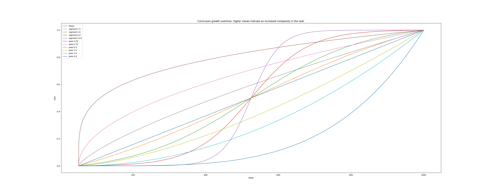

# Curriculum
To prevent penalties, disturbances, or tasks from being to hard from the beginning,
we use simple fixed curriculum strategies. Here fixed denotes that the rate at which
the task becomes harder is not dynamically adapting to the agent's current capacities.
Instead, it relies on the current step to set the difficulty accordingly.

## Parametrizing the curriculum
In the following we present how to setup the different components of our curriculum objects.

### Setting up the scheduling/rate of the curriculum
To set the schedule or rate, of the curriculum we provide three main functions:
 - a `sigmoid` style growth.
 - a `power` style growth.
 - a `linear` style growth.

Below, we provide 3 sample configuration for each of these functions.

```yaml
rate_parameters: # Sigmoid
  function: sigmoid
  start: 0
  end: 1000
  extent: 4.5 # Must be larger than 0.
```

```yaml
rate_parameters: # Linear
  function: linear
  start: 0
  end: 1000
```

```yaml
rate_parameters: # Power
  function: power
  start: 0
  end: 1000
  alpha: 2.0 # Can be smaller than 1! Must be larger than 0.
```


How the different parameters impact the scheduling of the curiculum is given in the figure below.
Note than once the scheduler reaches 1.0 it means that the highest difficulty has been reached.
The value outside of the scheduler is always comprised between \[0,1\].

The different functions with various parameters. We can see that for the `sigmoid``, large extent
for instance 12, generate sigmoid with a steeper slope, while smaller extent get closer to the `linear`.
Similarly, create a `power` function with parameter `alpha` set to 1.0 will generate the exact same curve
as the `linear` function. When `alpha` larger than 1.0 will have a small slope at the beginning and a high
slope at the end, and `alpha` smaller than 1.0 will have the opposite.


### Setting up the sampler of the curriculum

## Modifying the curriculum

### Modifying the scheduler

### Modifying the sampler