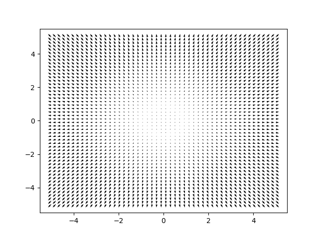
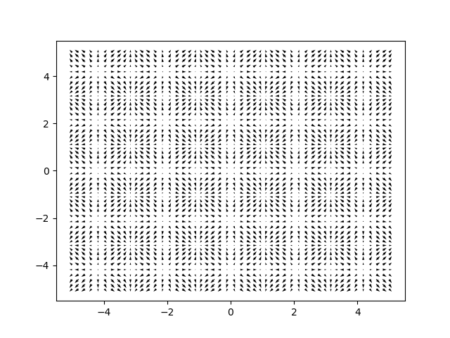

# Domain Randomization

Unlike the regular version of OmniIsaacGymEnv, this modified version chooses to apply domain randomization 
directly inside the task. This is done so that different parameters can receive different level of noise.
For instance, the state is composed of unnormalized angular values and linear velocity values, both of which 
have largely different scales. Furthermore, the domain randomization we apply here is not limited to noise 
on actions or observations, but we also offer the possibility to randomize the mass of the system,
or apply forces and torques directly onto the system.

All the parameters to add domaine randomization onto the system must be added under the `task.env.disturbances`
flag inside the configuration file. As of today, we support the following disturbances:
 - `force_disturbance` it applies random amount of forces at the system origin.
 - `torque_disturbance` it applies random amount of torque at the system origin.
 - `mass_disturbance` it changes the mass, and center of mass of the system.
 - `observations_disturbance` it adds noise onto the obervations.
 - `actions_disturbance` it adds noise onto the actions.


## Applying disturbances

In the following, we will go over the different parameters available for the disturbances and how to set them.
All the disturbances build ontop of a scheduler, and a sampler.
The scheduler regulates how quickly the disturbances should take effect during the training.
The sampler allows to randomly pick the amount of disturbance that should be apply on each environment.
A detailed explenation of the schedulers and samplers can be found in the curriculum documentation [LINK].

### Force disturbance
This disturbance applies a force on the system. By default, the force is applied at the root/origin of the body.
This behavior can be adjusted by modifying the body on which the force is applied. When setting the parameters
for the disturbance the user will select the magnitude of the force. It will then be randomly applied in a plane,
or on a sphere. Practically this is done by sampling a radius value (that is the magnitude) using the scheduler
and sampler. Then a theta value (for a 2D problem), or a theta and phi value (for a 3D problem), are sampled
uniformly projecting the force accordingly.

Below, is an example of a configuration, please note that all the parameters have default values.
So you do not need to add them unless you want to modify them. In this example, the sampler is
following a `truncated_normal` distribution (a normal distribution with extremas) and the 
scheduler is using a sigmoid growth. We can see that at the begining, there will be almost no force applied,
at the end it is almost uniformly sampled on the \[0, 0.5\] range.

```yaml
force_disturbance:
  enable: False # Setting this to True will enable this disturbance
  use_sinusoidal_patterns: False # Setting this to True will create none-constant forces.
  min_freq: 0.25
  max_freq: 3
  min_offset: -6
  max_offset: 6
  # Scheduling and sampling of the disturbance
  force_curriculum:
    rate_parameters:
      function: sigmoid
      start: 250
      end: 1250
      extent: 4.5
    sampling_parameters:
      distribution: truncated_normal
      start_mean: 0.0
      start_std: 0.0001
      end_mean: 0.5
      end_std: 0.5
      min_value: 0.0
      max_value: 0.5
```

Setting the `enable` flag to `True` is required for the penalty to be applied. If the flag is left to `False``,
the penalty will not be applied onto the platform.

Setting the `use_sinusoidal_patterns` flag to `False` will mean that each environment will have a constant force applied on it.
If this flag is set to `True`, the force magnitude will be modified depending on the position of the system.
This is meant to recreate attraction and repulsion points. The non-constant force means that recurrent networks will struggle more
to reliably estimate the disturbance.

| | |
Figure: Two sinusoidal patterns with different frequencies, 0.25: left, 3.0: right.

Please note that the values for the sinusoidal patterns and the magnitude of the force are updated on an environment reset only.
This means that the magnitude of the force will not evolve through an episode.

### Torque disturbance
This disturbance applies a torque on the system. By default, the torque is applied at the root/origin of the body.
This behavior can be adjusted by modifying the body on which the torque is applied. When setting the parameters
for the disturbance the user will select the magnitude of the torque. It will then be randomly applied in a plane,
or on a sphere. Practically this is done by sampling a radius value (that is the magnitude) using the scheduler
and sampler. For a 2D problem, this is the only thing needed, as there is only 1 rotation DoF. For a 3D problem,
theta and phi value (for a 3D problem), are sampledcuniformly projecting the torque accordingly.

Below, is an example of a configuration, please note that all the parameters have default values.
So you do not need to add them unless you want to modify them. In this example, the sampler is
following a `truncated_normal` distribution (a normal distribution with extremas) and the 
scheduler is using a sigmoid growth. We can see that at the begining, there will be almost no torque applied,
at the end it is almost uniformly sampled on the [0, 0.1] range.

```yaml
torque_disturbance:
  enable: False # Setting this to True will enable this disturbance
  use_sinusoidal_patterns: False # Setting this to True will create none-constant forces.
  min_freq: 0.25
  max_freq: 3
  min_offset: -6
  max_offset: 6
  # Scheduling and sampling of the disturbance
  torque_curriculum:
    rate_parameters:
      function: sigmoid
      start: 250
      end: 1250
      extent: 4.5
    sampling_parameters:
      distribution: truncated_normal
      start_mean: 0.0
      start_std: 0.0001
      end_mean: 0.0
      end_std: 0.2
      min_value: -0.1
      max_value: 0.1
```

Setting the `enable` flag to `True` is required for the penalty to be applied. If the flag is left to `False``,
the penalty will not be applied onto the platform.

Setting the `use_sinusoidal_patterns` flag to `False` will mean that each environment will have a constant torque applied on it.
If this flag is set to `True`, the torque magnitude will be modified depending on the position of the system.
This is meant to recreate attraction and repulsion points. The non-constant torque means that recurrent networks will struggle more
to reliably estimate the disturbance.

| | |
Figure: Two sinusoidal patterns with different frequencies, 0.25: left, 3.0: right.

Please note that the values for the sinusoidal patterns and the magnitude of the torque are updated on an environment reset only.
This means that the magnitude of the torque will not evolve through an episode.

### Mass disturbance
The mass disturbances allows to randomize the mass and the CoM of a rigid body. While it is not currently
possible to randomize the CoM of a rigid bodies inside omniverse, we solve this issue by adding two prismatic
joints to the system, at the end of which lies a fixed mass. All of the other elements inside of
the system are changed to have almost no mass such that the only meaningful contribution to the total system
mass and CoM comes from this movable body.
To randomize the mass value, a scheduler and sampler are used, the mass is directly sampled from it.
For the CoM, another set of scheduler and sampler are used, from it a radius is sampled which can then
be used to move the CoM in a 2D plane by uniformly sampling a theta value, or using in 3D by uniformly
sampling a theta and phi value.

Below is an example configuration, please note that all the parameters have default values.
So you do not need to add them unless you want to modify them. In this example, we can see
that both the mass and the CoM have indepent samplers and rates.

```yaml
mass_disturbance:
  enable: False # Setting this to True will enable this disturbance
  # Scheduling and sampling of the mass disturbance
  mass_curriculum:
    rate_parameters:
      function: sigmoid
      start: 250
      end: 1250
      extent: 4.5
    sampling_parameters:
      distribution: truncated_normal
      start_mean: 5.32 # Initial mass
      start_std: 0.0001 # Low std ensures the mass will remain constand during warmup
      end_mean: 5.32
      end_std: 3.0
      min_value: 3.32
      max_value: 7.32
  # Scheduling and sampling of the CoM disturbance
  com_curriculum:
    rate_parameters:
      function: sigmoid
      start: 250
      end: 1250
      extent: 4.5
    sampling_parameters:
      distribution: truncated_normal
      start_mean: 0.0 # displacement about the resting position of the CoM joints
      start_std: 0.0001 # Low std ensures the mass will remain constand during warmup
      end_mean: 0.25
      end_std: 0.25
      min_value: 0.0
      max_value: 0.25
```

Setting the `enable` flag to `True` is required for the penalty to be applied. If the flag is left to `False``,
the penalty will not be applied onto the platform.

### Observations disturbance
The observations disturbance adds a given type of noise onto the different constituting elements of the 
observation tensor. The noise can be independently controlled and applied or not on 3 type of variables:
 - positions (meters)
 - velocities (meters/s or radians/s)
 - orientation (radians)
For each of them, a scheduler and sampler can be set up, enabling fine control over how the system is exposed
to observation noise during its training.

below is am example configuration, please note that all the parameters have default values.
So you do not need to set them unless you want to modify them.

```yaml
observations_disturbance:
  enable_position_noise: False # Setting this to True will enable this disturbance
  enable_velocity_noise: False # Setting this to True will enable this disturbance
  enable_orientation_noise: False # Setting this to True will enable this disturbance
  # Scheduling and sampling of the position disturbance
  position_curriculum:
    rate_parameters:
      function: sigmoid
      start: 250
      end: 1250
      extent: 4.5
    sampling_parameters:
      distribution: truncated_normal
      start_mean: 0.0
      start_std: 0.0001
      end_mean: 0.0
      end_std: 0.03
      min_value: -0.015
      max_value: 0.015
  # Scheduling and sampling of the velocity disturbance
  velocity_curriculum:
    rate_parameters:
      function: sigmoid
      start: 250
      end: 1250
      extent: 4.5
    sampling_parameters:
      distribution: truncated_normal
      start_mean: 0.0
      start_std: 0.0001
      end_mean: 0.0
      end_std: 0.03
      min_value: -0.015
      max_value: 0.015
  # Scheduling and sampling of the orientation disturbance
  orientation_curriculum:
    rate_parameters:
      function: sigmoid
      start: 250
      end: 1250
      extent: 4.5
    sampling_parameters:
      distribution: truncated_normal
      start_mean: 0.0
      start_std: 0.0001
      end_mean: 0.0
      end_std: 0.05
      min_value: -0.025
      max_value: 0.025
```

Setting the `enable` flag to `True` is required for the penalty to be applied. If the flag is left to `False``,
the penalty will not be applied onto the platform.

### Actions disturbance
The actions disturbance adds a given type of noise onto the actions sent by the agent. In our case this is done by
adding (or removing) some force to the output of the thrusters. This should be scale accordingly with the maximum
thrust that your system is capable of. Similarly to all previous disturbances, it also comes with a scheduler and
a sampler.

below is am example configuration, please note that all the parameters have default values.
So you do not need to set them unless you want to modify them.

```yaml
actions_disturbance:
  enable: False # Setting this to True will enable this disturbance
  # Scheduling and sampling of the disturbance
  action_curriculum:
    rate_parameters:
      function: sigmoid
      start: 250
      end: 1250
      extent: 4.5
    sampling_parameters:
      distribution: truncated_normal
      start_mean: 0.0
      start_std: 0.0001
      end_mean: 0.0
      end_std: 0.1
      min_value: -0.05
      max_value: 0.05
```

Setting the `enable` flag to `True` is required for the penalty to be applied. If the flag is left to `False``,
the penalty will not be applied onto the platform.

## Adding new disturbances
To add new disturbances, we would recommend adding them within the file located within `tasks/virtual_floating_platform/MFP2D_disturbances.py`,
with its defaut parameters given inside `tasks/virtual_floating_platform/MFP2D_disturbances_parameters.py`. Or its 3D counter part.

### Creating a new set of parameters
To create a new set of parameters for a disturbance, you should create a dataclass, with that comes with a scheduler and sampler.
An example of such a class is given below:

```python
@dataclass
class NoisyActionsParameters:
    """
    This class provides an interface to adjust the hyperparameters of the action noise.
    """
    # Note how the default factory is an empty dict. This is leveraged to
    # enable automatic building of the CurriculumParameters.
    action_curriculum: CurriculumParameters = field(default_factory=dict)
    # Here you could add any other parameters as long as they have a
    # default type and value.
    enable: bool = False

    def __post_init__(self):
        # We transform the dictionary into a CurriculumParameter object.
        # This action automatically converts the dictionnary.
        # Note though that this does not support unknown keys.
        # I.e. if a the user adds a key that does not exist, the 
        # dataclass will complain.
        self.action_curriculum = CurriculumParameters(**self.action_curriculum)
```

This very simple class creates the required parameters for the scheduler.
You can of course add your own set of parameters. Do not forget to specify their type, and
assign a default value. This is important as the class disturbance should be instantiable
even if no parameter is given.

To wrap up the parameters part, you will need to add this disturbance to the list of 
allowed disturbances. This can be done by adding it to the `DisturbancesParameters` class
at the end of the `tasks/virtual_floating_platform/MFP2D_disturbances_parameters.py`.

```python
@dataclass
class DisturbancesParameters:
    [...] # Some more disturbances
    actions_disturbance: NoisyActionsParameters = field(default_factory=dict)

    def __post_init__(self):
        [...] # Some more initializations
        # Here we build the object, note that this will automatically retrieve everything under
        # `task.env.disturbances.actions_disturbance` inside the configuration file.
        self.actions_disturbance = NoisyActionsParameters(**self.actions_disturbance)
```

### Creating a new disturbance
With the parameters created you can now create the class that will implement your new
disturbance. Below, we provide and example of how this could be done.


```python
class NoisyActions:
    """
    Adds noise to the actions of the robot."""

    def __init__(
        self,
        parameters: NoisyActionsParameters,
        num_envs: int,
        device: str,
    ) -> None:
        """
        Args:
            parameters (NoisyActionParameters): The task configuration.
            num_envs (int): The number of environments.
            device (str): The device on which the tensors are stored.
        """

        # Here the parameters from the sampler are being loaded and transformed
        # into and object that can be used to sample different noises.
        self.action_sampler = CurriculumSampler(parameters.action_curriculum)
        # This is used in case you'd want to access other parameters.
        self.parameters = parameters
        # These are used to known how many environments are used, and the device
        # on which the tensors must be store.
        self._num_envs = num_envs
        self._device = device

    def add_noise_on_act(self, act: torch.Tensor, step: int = 0) -> torch.Tensor:
        """
        Adds noise to the actions of the robot.

        Args:
            act (torch.Tensor): The actions of the robot.
            step (int, optional): The current step of the learning process. Defaults to 0.

        Returns:
            torch.Tensor: The actions of the robot with noise.
        """

        if self.parameters.enable:
            # Note that this depends on the current step / epoch of the training
            # this is particularly important for the scheduler as it uses this
            # information to adjust its rate
            act += self.action_sampler.sample(self._num_envs, step, device=self._device)
        return act
```

With this done, we now need to instantiate our disturbance, this can be done by adding it
to the `Disturbances` class at the end of the `MFP2D_disturbances.py` (or its 3D counterpart).

This is done as shown below:

```python
class Disturbances:
    """
    Class to create disturbances on the platform.
    """

    def __init__(
        self,
        parameters: dict,
        num_envs: int,
        device: str,
    ) -> None:
        """
        Args:
            parameters (dict): The settings of the domain randomization.
            num_envs (int): The number of environments.
            device (str): The device on which the tensors are stored.
        """

        self._num_envs = num_envs
        self._device = device

        # Loads all the parameters after `task.env.disturbances` inside the configuration file.
        self.parameters = DisturbancesParameters(**parameters)

        [...] # Some more initialization

        # This builds the object
        self.noisy_actions = NoisyActions(
            self.parameters.actions_disturbance,
            num_envs,
            device,
        )

```

With all this done, your disturbance can be parametrized, and instantiated!
All that's left to do is to apply it!

### Applying domain randomization

First we need to instantiate the `Disturbances` class.
This can be done as shown below:

```python
# Get all the parameters inside the task config as a dict
self._task_cfg = sim_config.task_config
# Get the dict related to the disturbances
domain_randomization_cfg = self._task_cfg["env"]["disturbances"]
# Initializes the disturbances
self.DR = Disturbances(
    domain_randomization_cfg,
    num_envs=self._num_envs,
    device=self._device,
)
```

This should be done in the `__init__` method of your task.

With this done you can apply it as you see fit.
In this example this would be done like so:

```python
thrusts = self.DR.noisy_actions.add_noise_on_act(thrusts)
```

Happy coding!